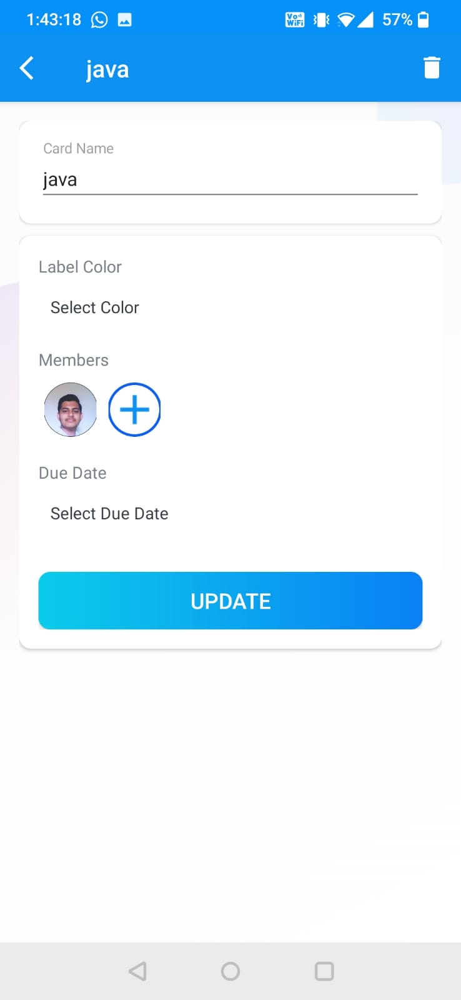
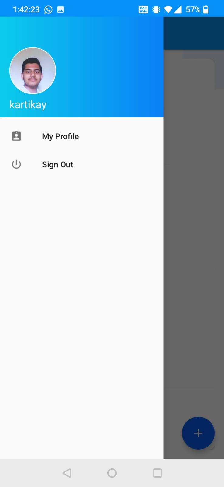
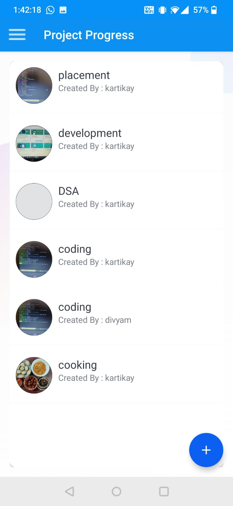
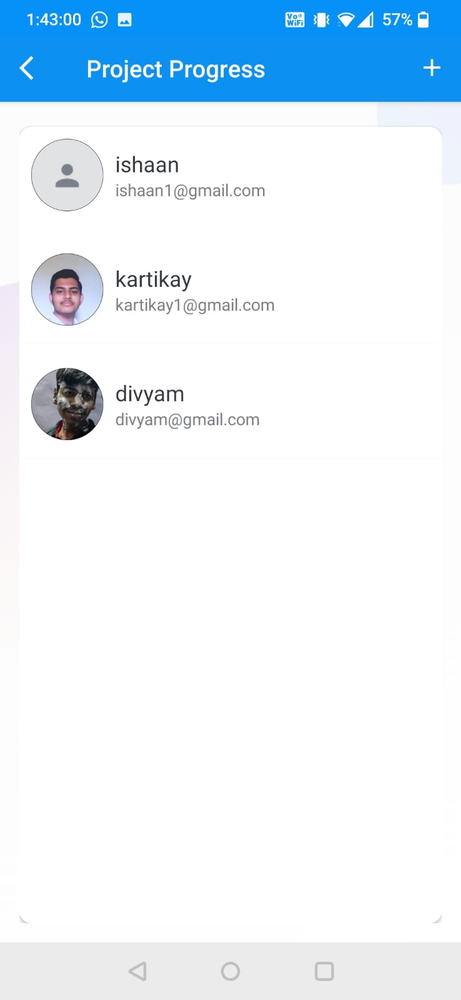
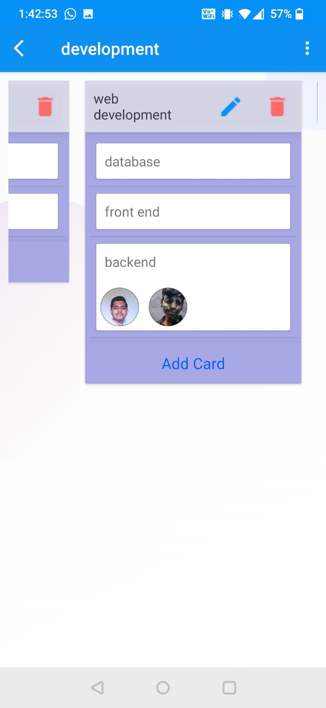

# Project-Progress-and-Management-App
In this project I have added authentication to signin and signout by using the email verifation at first, whole data is stored in the firestore. I have added various boards in which each board has various tasks and the user has the power to assign these tasks to other users who are registered on this app. Also the small things can be added about task in the app.
In this i have learnt about firebase/firestore, recycler-view, dexter, Glide, Drag and Drop functionality. 

Here are the glimpses of the UI of the app:-

<h4>card activity</h4>

  

<h4>Dashboard Activity</h4>

  

<h4>main activity</h4>

  

<h4>members activity</h4>

  

<h4>task activity</h4>

  

